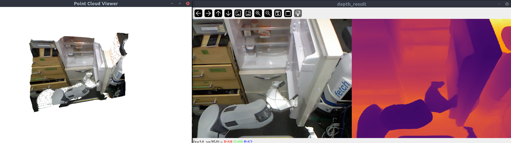
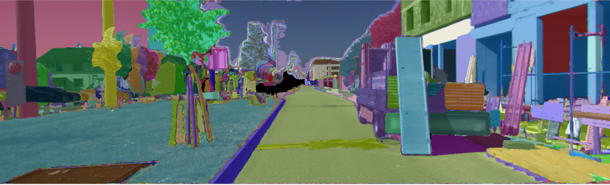
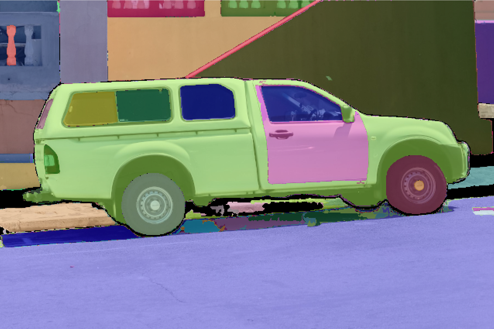

# slamplay 

Author: [Luigi Freda](https://www.luigifreda.com)

<!-- TOC -->

- [slamplay](#slamplay)
    - [1. How to start](#1-how-to-start)
        - [1.1. Configuration](#11-configuration)
        - [1.2. Install data](#12-install-data)
        - [1.3. Deep learning DL](#13-deep-learning-dl)
            - [1.3.1. Intall DL models](#131-intall-dl-models)
            - [1.3.2. GPU support with CUDA, cuDNN, TensorRT](#132-gpu-support-with-cuda-cudnn-tensorrt)
            - [1.3.3. Install tensorflow C++ API](#133-install-tensorflow-c-api)
    - [2. Docker](#2-docker)
    - [3. Eigen Tutorials](#3-eigen-tutorials)
    - [4. Front-end](#4-front-end)
        - [4.1. Features DL Deep Learning](#41-features-dl-deep-learning)
        - [4.2. Depth DL](#42-depth-dl)
        - [4.3. Tensorflow C++ API](#43-tensorflow-c-api)
    - [5. Back-end](#5-back-end)
        - [5.1. GTSAM examples](#51-gtsam-examples)
        - [5.2. Ceres examples](#52-ceres-examples)
        - [5.3. g2o examples](#53-g2o-examples)
    - [6. IO](#6-io)
        - [6.1. chrono](#61-chrono)
    - [7. Profiling](#7-profiling)
        - [7.1. Tracy](#71-tracy)
    - [8. Credits](#8-credits)
    - [9. License](#9-license)

<!-- /TOC -->


 **slamplay** is a collection of powerful tools to start playing and experimenting with **SLAM in C++**. It automatically installs and makes available in a single cmake framework some of the most important    
 - back-end frameworks (*g2o*, *gtsam*, *ceres*, *se-sync*, etc.),     
 - front-end tools (*OpenCV*, *pcl*, etc.),      
 - algebra and geometry libs (*eigen*, *sophus*, *cholmod*, etc.),    
 - viz tools (*pangolin*, *imgui*, *rerun*, etc.),     
 - loop-closure frameworks (*DBoW2*, *DBoW3*, *iBoW*, etc.),
 - deep learning tools (based on *TensorRT*, *tensorflow_cc*, *libtorch*, *onnxruntime*, etc.),     
  
along with some nice examples in order to easily and quickly start with all these tools.  

I created **slamplay** for a computer vision class I taught. I started developing it for fun, during my free time, taking inspiration from some repos available on the web.  

<p align="center">
 
 
 
 
 
 
 
</p>
  
This repository is structured in the following main folders (with self-explanatory names): 
- `algebra_geometry`
- `backend`
- `core` 
- `data`
- `dense_mapping`
- `docs`
- `frontend` **(*)**
- `full_slam`
- `io`
- `loop_closure`
- `scripts`
- `semantics` **(*)**
- `utils`
- `viz`
  
**(*)** With **new** C++ tools based on *TensorRT*, *tensorflow_cc*, *onnxruntime*, e.g, *SuperPoint*, *SuperGlue*, *Depth-Anything*, *HFNet*, *Segment-Anthing-Model* *(SAM)*.

---

## How to start

The following procedure has been successfully tested under **Ubuntu 20.04**, **22.04** and **24.04**. 

- Install required basic dependencies:      
  `$ ./install_dependencies.sh`        
- Install OpenCV in a local folder:                
  `$ ./install_local_opencv.sh`        
- Build the framework:      
  `$ ./build.sh`

This will take a while. Once everything is built, you can enter in the `build` folder and test the different examples. In particular, to test the `full_slam` apps: 
1. Configure `full_slam/config/kitti.yaml` (or `full_slam/config/euroc.yaml`)
2. Then run the VO (Visual Odometry) app:
   ```bash 
   $ cd build/full_slam/apps
   $ ./run_kitti_stereo # or ./run_euroc_stereo
   ```


### Configuration 

The file `config.sh` with its environment variable defines your working configuration. This will be automatically sourced by all the main install/build scripts. 

For instance, if you want to skip the OpenCV install step then set the variable `OpenCV_DIR` in `config.sh` with your local OpenCV path. This is not recommended though since  different dep libs can be mixed (with undefined behavior) and you may lose some of the available features too.  

### Install data

If you want to smoothly run the *slamplay* examples using default input data then dowload the provided testing images and videos (will be deployed in the `data` folder):    
  `$ ./install_data.sh`    

### Deep learning (DL)

#### Intall DL models 

If you want to use the DL (Deep Learning) models then run the following command to download both neural network weights/checkpoints with their related data:    
  `$ ./install_dl_models.sh`     

#### GPU support with `CUDA`, `cuDNN`, `TensorRT`

 I recommend [these tested configurations](./GPU_support.md) with `CUDA` ecosystem.

#### Install tensorflow C++ API

If you want to install and test tensorflow C++ API (for HFNet), then run:     
  `$ ./install_tensorflow_cc.sh`      
  See the repository [tensorflow_cc](https://github.com/luigifreda/tensorflow_cc) for further details. This step will take a long while and for this reason you are required to manually launch the script `install_tensorflow_cc.sh`.  
  
--- 

## Docker 

If you prefer to use docker for working with *slamplay*, you may want to use [rosdocker](https://github.com/luigifreda/rosdocker) with one of its provided images (w/ or w/o `CUDA` support).

---

## Eigen Tutorials

See the nice [ascii quick reference](docs/Eigen-AsciiQuickReference.txt). 

* [Quick reference](https://eigen.tuxfamily.org/dox/group__QuickRefPage.html)
* [Dense matrix manipulation](https://eigen.tuxfamily.org/dox/group__DenseMatrixManipulation__chapter.html)
* [Dense linear problems and decompositions](https://eigen.tuxfamily.org/dox/group__DenseLinearSolvers__chapter.html)
* [Sparse linear algebra](https://eigen.tuxfamily.org/dox/group__Sparse__chapter.html)
* [Geometry](https://eigen.tuxfamily.org/dox/group__Geometry__chapter.html)


---

## Front-end

A couple of notes about some of the available front-end features. 

### Features DL (Deep Learning)

In `frontend/feature_dl` you can find: 
- A C++ implementation of SuperPoint and SuperGlue under TensorRT
- A C++ implementation of [HFNet](https://github.com/ethz-asl/hfnet) under TensorRT and Tensorflow. 

**Warning**: The first time you run a TensorRT model, it will take some time to convert the input *onnx* model to its *engine* format. 

### Depth DL

In `frontend/depth_dl` you can find: 
- A C++ implementation of [Depth-Anything-V2.0](https://github.com/DepthAnything/Depth-Anything-V2) based on TensorRT.

**Warning**: The first time you run a TensorRT model, it will take some time to convert the input *onnx* model to its *engine* format. 


### Tensorflow C++ API

As explained above, if you want to install and test tensorflow C++ API (e.g. for HFNet), then run:     
`$ ./install_tensorflow_cc.sh`      
See [tensorflow_cc](https://github.com/luigifreda/tensorflow_cc) for further details. Note that this step will take a long while and for this reason it is required you manually launch `install_tensorflow_cc.sh`.  

See [this file](./GPU_support.md) for other notes about GPU support and the used `CUDA` ecosystem.

---

## Back-end

A couple of notes about some of the available back-end frameworks. 

### GTSAM examples

Installed tag **4.2a9**
* https://github.com/borglab/gtsam/tree/4.2a9/examples

Documentation
* https://gtsam.org/docs/
* https://gtsam.org/tutorials/intro.html 
* See `docs` folder for further documentation.  

**Known issues**
Apparently, in order to avoid *double free or corruption* errors with gtsam on exit, we need to disable the compile option `-march=native` when building apps that use gtsam. This can be done locally by modifying the compile flags at the folder level and removing march native optimization for gtsam-related files. Further details are available in the following links: 
- https://bitbucket.org/gtborg/gtsam/issues/414/compiling-with-march-native-results-in
- https://groups.google.com/g/gtsam-users/c/jdySXchYVQg 

### Ceres examples 

Installed tag **2.1.0**
* https://ceres-solver.googlesource.com/ceres-solver/+/refs/tags/2.1.0/examples/

Documentation
* http://ceres-solver.org/tutorial.html
* See `docs` folder for further documentation. 

### g2o examples

Installed tag *20230223_git*. See related [examples](
https://github.com/RainerKuemmerle/g2o/tree/20230223_git/g2o/examples).

**Issues:**
  - The built g2o-dependant binaries link to the system g2o (instead of the locally compiled and installed g2o) and this brings to crashes (a different g2o version is linked). There are different solutions to this problem: 
    * Standard one (uncomfortable): use `LD_LIBRARY_PATH` to make the built binaries correctly link to the locally compiled and installed g2o.
    * Otherwise, we can use and set `RPATH` (instead of `RUNPATH`) at build time. In particular, this can be done by using some compiler options. This is what I set in the main cmake file: 
  `set(MY_FLAGS "${MY_FLAGS} -Wl,--disable-new-dtags")`
  https://stackoverflow.com/questions/47117443/dynamic-linking-with-rpath-not-working-under-ubuntu-17-10 
  This configuration is enabled/disabled by the cmake option flag `SET_RPATH`. 
  - If you get a *double free or corruption* error with g2o (on exit), then it is very likely you used `-march=native` option when compiling this project but you didn't use the same option for building g2o itself. This may cause some alignment inconsistencies between g2o and this project. Then, in that case, build g2o with `-march=native` (i.e. use the cmake option `-DBUILD_WITH_MARCH_NATIVE=ON`)   


---

##  IO

A couple of notes about the IO library utils and examples. 

### chrono

https://www.modernescpp.com/index.php/the-three-clocks 

**Differences amongst the three different clocks?**

- **std::chrono::sytem_clock**: This is the system-wide real-time clock (wall-clock). The clock has the auxiliary functions to_time_t and from_time_t to convert time points into dates.
- **std::chrono::steady_clock**:  Provides as only a clock the guarantee that you can not adjust it. Therefore, std::chrono::steady_clock is the preferred clock to wait for a time duration or until a time point.
- **std::chrono::high_resolution_clock**: This is the clock with the highest accuracy, but it can be a synonym for the clock's std::chrono::system_clock or std::chrono::steady_clock.
  
The C++ standard provides no guarantee about the clocks' accuracy, starting point, or valid time range. Typically, the starting point of std::chrono:system_clock is the 1.1.1970, the so-called UNIX-epoch. For std::chrono::steady_clock, typically the boot time of your PC.

**What is the difference between steady_clock vs system_clock in layman terms?**

If you're holding a *system_clock* in your hand, you would call it a watch, and it would tell you what time it is.

If you're holding a *steady_clock* in your hand, you would call it a stopwatch, and it would tell you how fast someone ran a lap, but it would not tell you what time it is.


---

## Profiling

### Tracy 

Tracy is a great profiler that will be automatically installed by the main build script `build.sh`. 
Repository link: https://github.com/wolfpld/tracy. Documentation is [here](https://github.com/wolfpld/tracy/releases/latest/download/tracy.pdf).

- Include `profiler/profiler_tracy.h` in every file you are interested in profiling.
- Check `TRACY_ENABLE` is defined for the WHOLE project (`slamplay` automatically takes care of that if you set `USE_TRACY=1` in `config.sh`).
- Add the macro `FrameMark` at the end of each frame loop. (Jump this: The latest version of tracy does not seem to support well this)
- Add the macro `ZoneScoped` as the first line of your function definitions to include them in the profile.
- Run tracy profiler: `./thirdparty/tracy/tracy-profiler` and hit the connect button. 
- Compile and run your application.
- You’re profiling your program! Go to tracy interface and hit the `statistics` button.

---

## Credits  

* This repo imported some of the C++ examples (updated, improved, and commented) of the repository https://github.com/gaoxiang12/slambook2. Thanks to the Author for his great work. 
* Thanks to the Author of the repository https://github.com/nicolov/simple_slam_loop_closure/. I imported a couple of scripts (updated and improved) from his repository (for computing the confusion matrix). 
* Thanks to yuefanhao for his repo https://github.com/yuefanhao/SuperPoint-SuperGlue-TensorRT .
* Thanks to the Authors of the repository https://github.com/LiuLimingCode/HFNet_SLAM. I integrated and adapted part of their C++ implementation of HFNet NN.
* Thanks to the Authors of the repositories https://github.com/spacewalk01/depth-anything-tensorrt and https://github.com/ojh6404/depth_anything_ros. I adapted and integrated some parts of their C++ classes and script for DepthAnything v2 NN.

---
## License 

`slamplay` is released under [GPLv3 license](./LICENSE). `slamplay` contains some modified libraries, each one coming with its license. Where nothing is specified, a GPLv3 license applies to the software.
