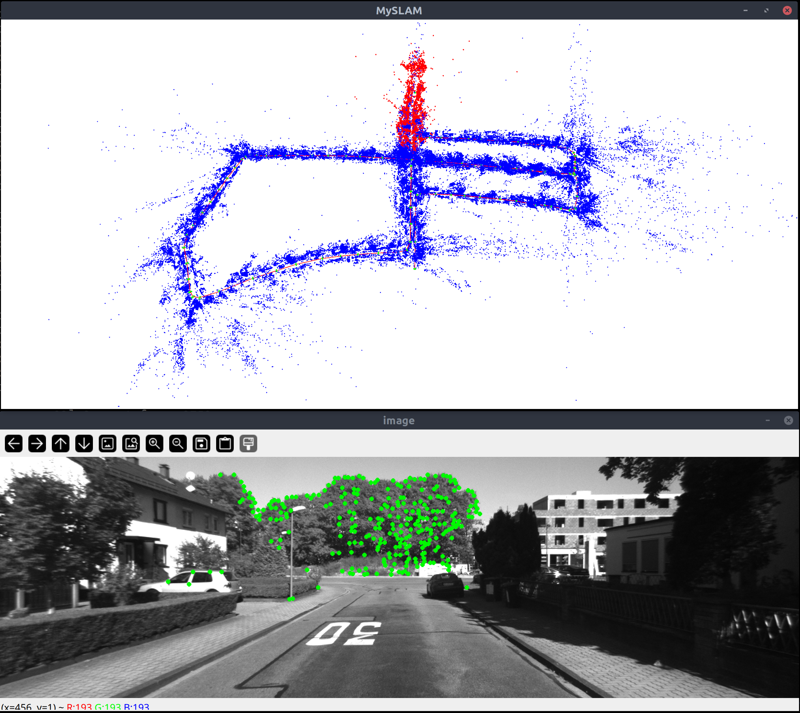
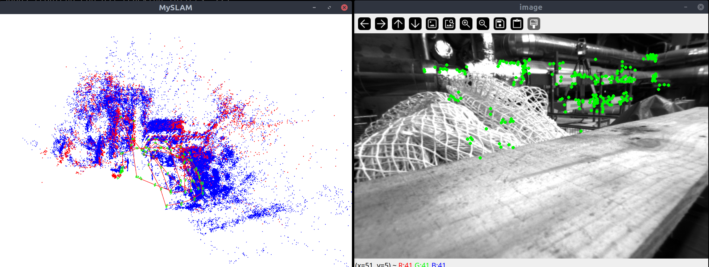
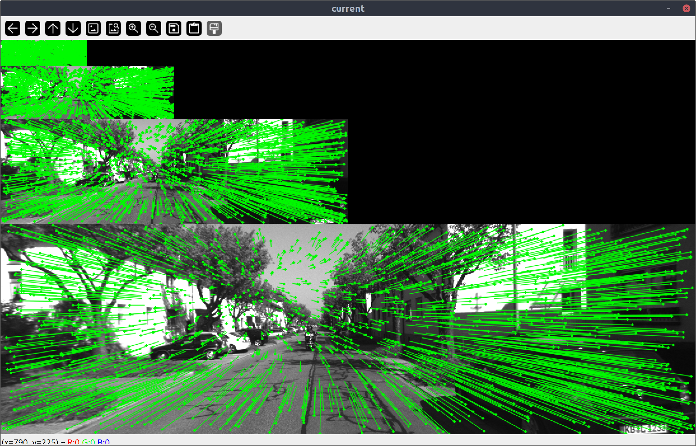
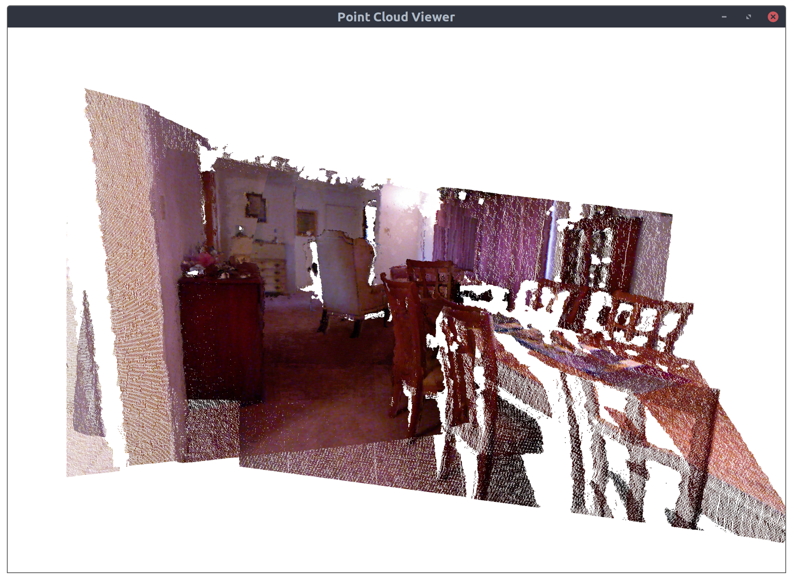

# slamplay 

<!-- TOC -->

- [slamplay](#slamplay)
  - [Quick start](#quick-start)
  - [Eigen Tutorials](#eigen-tutorials)
  - [Back-end](#back-end)
    - [GTSAM examples](#gtsam-examples)
    - [Ceres examples](#ceres-examples)
    - [g2o examples](#g2o-examples)
  - [Front-end](#front-end)
  - [IO](#io)
    - [chrono](#chrono)
  - [Utils](#utils)
    - [Tracy](#tracy)
  - [Credits](#credits)

<!-- /TOC -->

 **slamplay** is a collection of powerful tools to start playing and experimenting with **SLAM in C++**. It's a work in progress. It installs and makes available in a single cmake framework some of the most important    
 - back-end frameworks (*g2o*, *gtsam*, *ceres*, *se-sync*, etc.),     
 - front-end tools (*OpenCV*, *pcl*, *TensorRT*, etc.),      
 - algebra and geometry libs (*eigen*, *sophus*, *cholmod*, etc.),    
 - viz tools (*pangolin*, *imgui*, *rerun*, etc.),     
 - loop-closure frameworks (*DBOW3*, *iBOW*, etc.),     
  
along with some nice examples in order to easily and quickly start with all these tools.  

I created **slamplay** for a computer vision class I recently taught. I started developing it for fun, during my free time, taking inspiration from some repos available on the web.  

 
 
 
 

  
This repository is structured in the following main folders (with self-explanatory names): 
- `algebra_geometry`
- `backend`
- `data`
- `dense_mapping`
- `docs`
- `frontend`  (**NEW** C++ TensorRT-based support for SuperPoint and SuperGlue)
- `full_slam`
- `io`
- `loop_closure`
- `dense_mapping`
- `scripts`
- `utils`
- `viz`
  
## Quick start 

- Install basic dependencies:      
  `$ ./install_dependencies.sh`        
- Install OpenCV in a local folder:                
  `$ ./install_local_opencv.sh`     
  (if you want, skip this step and set the variable `OpenCV_DIR` in `config.sh` with your local OpenCV path)     
- Build the framework:      
  `$ ./build.sh`

Once everything is built, you can enter in the `build` folder and test the different examples. 
In particular, you can enter in the `full_slam` folder: 
- configure the file `config/kitti.yaml` (or `config/euroc.yaml`)
- and run the VO app `app/run_kitti_stereo` (or `app/run_euroc_stereo`)

---

## Eigen Tutorials

See the nice [ascii quick reference](docs/Eigen-AsciiQuickReference.txt). 

* [Quick reference](https://eigen.tuxfamily.org/dox/group__QuickRefPage.html)
* [Dense matrix manipulation](https://eigen.tuxfamily.org/dox/group__DenseMatrixManipulation__chapter.html)
* [Dense linear problems and decompositions](https://eigen.tuxfamily.org/dox/group__DenseLinearSolvers__chapter.html)
* [Sparse linear algebra](https://eigen.tuxfamily.org/dox/group__Sparse__chapter.html)
* [Geometry](https://eigen.tuxfamily.org/dox/group__Geometry__chapter.html)

---

## Back-end

Some notes about the back-end frameworks. 

### GTSAM examples

Installed tag **4.2a9**
* https://github.com/borglab/gtsam/tree/4.2a9/examples

Documentation
* https://gtsam.org/docs/
* https://gtsam.org/tutorials/intro.html 
* See `docs` folder for further documentation.  

**ISSUES**
Apparently, in order to avoid *double free or corruption* errors with gtsam on exit, we need to disable the compile option `-march=native` when building apps that use gtsam. This can be done locally by modifying the compile flags at the folder level and removing march native optimization for gtsam-related files. Further details are in the following links: 
- https://bitbucket.org/gtborg/gtsam/issues/414/compiling-with-march-native-results-in
- https://groups.google.com/g/gtsam-users/c/jdySXchYVQg 

### Ceres examples 

Installed tag 2.1.0 
* https://ceres-solver.googlesource.com/ceres-solver/+/refs/tags/2.1.0/examples/

Documentation
* http://ceres-solver.org/tutorial.html
* See `docs` folder for further documentation. 

### g2o examples

Installed tag *20230223_git*. See related [examples](
https://github.com/RainerKuemmerle/g2o/tree/20230223_git/g2o/examples).

**Issues:**
  - The built g2o-dependant binaries link to the system g2o (instead of the locally compiled and installed g2o) and this brings to crashes (a different g2o version is linked). There are different solutions to this problem: 
    * Standard one (uncomfortable): use `LD_LIBRARY_PATH` to make the built binaries correctly link to the locally compiled and installed g2o.
    * Otherwise, we can use and set `RPATH` (instead of `RUNPATH`) at build time. In particular, this can be done by using some compiler options. This is what I set in my cmake configuration: 
  `set(MY_FLAGS "${MY_FLAGS} -Wl,--disable-new-dtags")`
  https://stackoverflow.com/questions/47117443/dynamic-linking-with-rpath-not-working-under-ubuntu-17-10 
  This configuration is enabled/disabled by the cmake option flag `SET_RPATH` I added. 
  - If you get a *double free or corruption* error with g2o (on exit), then it is very likely you used `-march=native` option when compiling this project but you didn't use the same option for building g2o itself. This may cause some alignment inconsistencies between g2o and this project. Then, in that case, build g2o with `-march=native` (i.e. use the cmake option `-DBUILD_WITH_MARCH_NATIVE=ON`)   

---

## Front-end

---

##  IO

### chrono

https://www.modernescpp.com/index.php/the-three-clocks 

**Differences amongst the three different clocks?**

- **std::chrono::sytem_clock**: This is the system-wide real-time clock (wall-clock). The clock has the auxiliary functions to_time_t and from_time_t to convert time points into dates.
- **std::chrono::steady_clock**:  Provides as only a clock the guarantee that you can not adjust it. Therefore, std::chrono::steady_clock is the preferred clock to wait for a time duration or until a time point.
- **std::chrono::high_resolution_clock**: This is the clock with the highest accuracy, but it can be a synonym for the clock's std::chrono::system_clock or std::chrono::steady_clock.
  
The C++ standard provides no guarantee about the clocks' accuracy, starting point, or valid time range. Typically, the starting point of std::chrono:system_clock is the 1.1.1970, the so-called UNIX-epoch. For std::chrono::steady_clock, typically the boot time of your PC.

**What is the difference between steady_clock vs system_clock in layman terms?**

If you're holding a *system_clock* in your hand, you would call it a watch, and it would tell you what time it is.

If you're holding a *steady_clock* in your hand, you would call it a stopwatch, and it would tell you how fast someone ran a lap, but it would not tell you what time it is.

---

## Utils

### Tracy 

Tracy is a great profiler. Repository link: https://github.com/wolfpld/tracy. Documentation is [here](https://github.com/wolfpld/tracy/releases/latest/download/tracy.pdf).

- Include `profiler/profiler_tracy.h` in every file you are interested in profiling.
- Check `TRACY_ENABLE` is defined for the WHOLE project (`slamplay` automatically takes care of that if you set `USE_TRACY=1` in `config.h`).
- Add the macro `FrameMark` at the end of each frame loop. (Jump this: The latest version of tracy does not seem to support well this)
- Add the macro `ZoneScoped` as the first line of your function definitions to include them in the profile.
- Run tracy profiler: `./thirdparty/tracy/tracy-profiler` and hit the connect button. 
- Compile and run your application.
- You’re profiling your program! Go to tracy interface and hit the `statistics` button.

---

## Credits  

* This repo imported some of the C++ examples (updated, improved, and commented) of the repository https://github.com/gaoxiang12/slambook2. Thanks to the Author for his great work. 
* Thanks to the Author of the repository https://github.com/nicolov/simple_slam_loop_closure/. I imported a couple of scripts (updated and improved) from his repository (for computing the confusion matrix). 
* Thanks to yuefanhao for his repo https://github.com/yuefanhao/SuperPoint-SuperGlue-TensorRT
