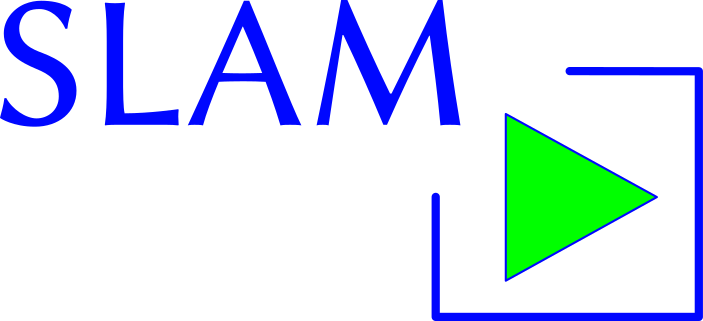
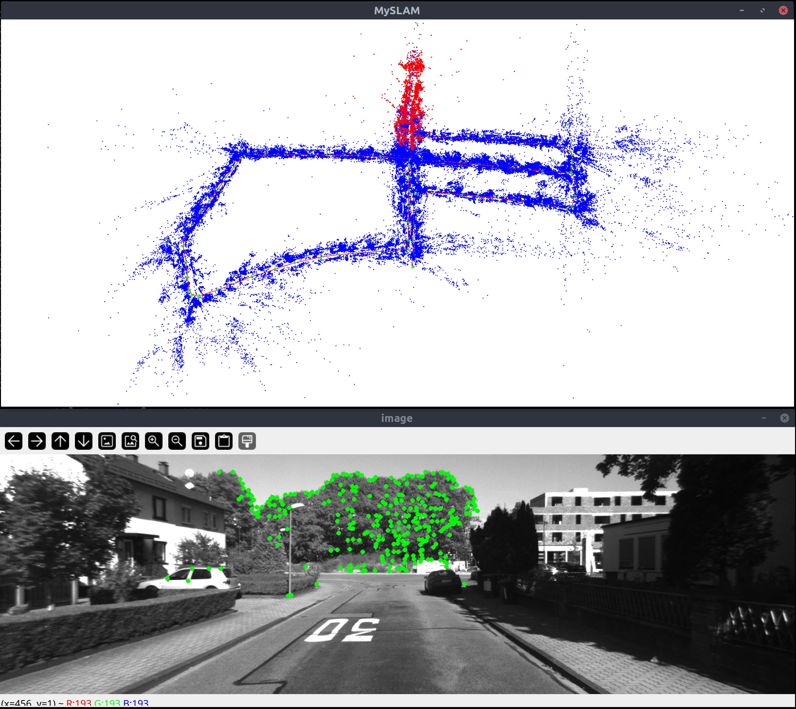
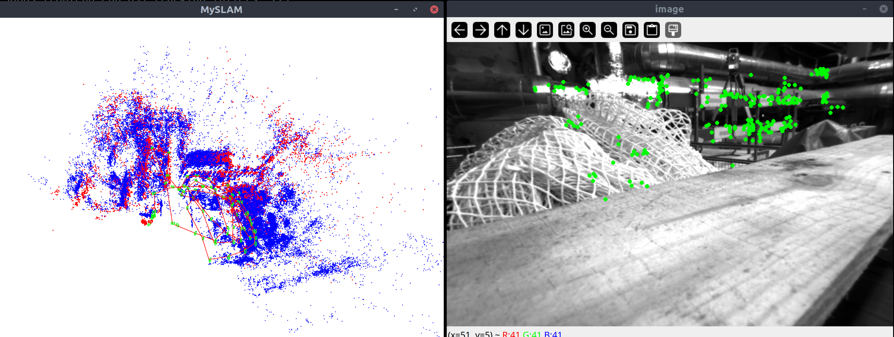
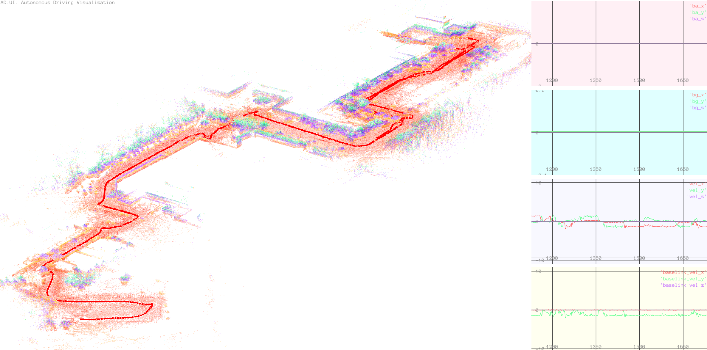
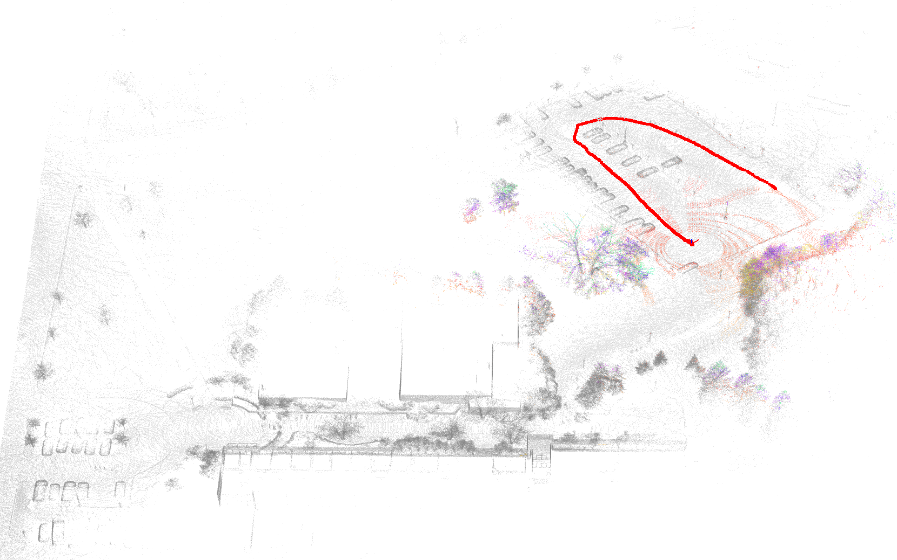
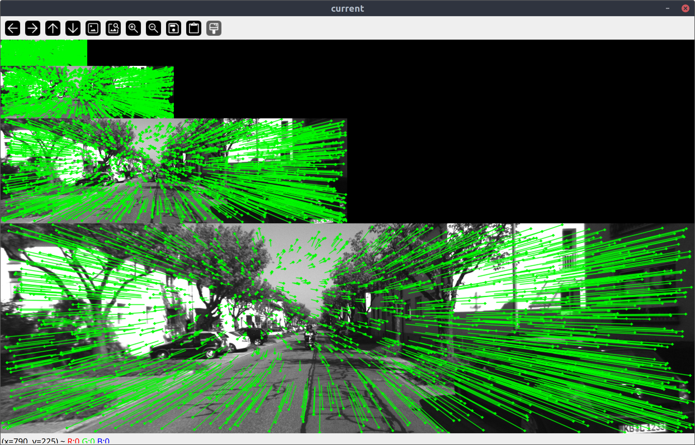
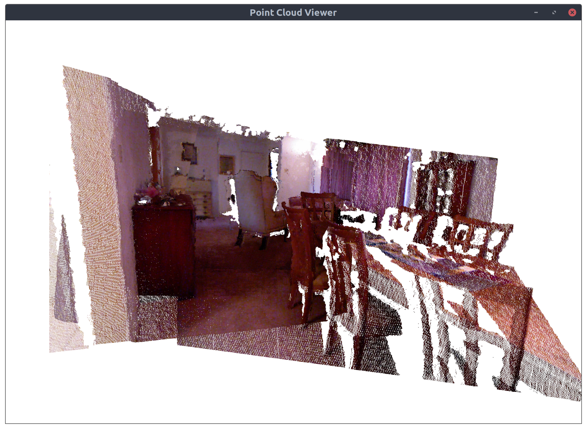
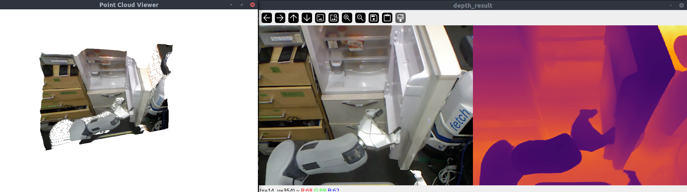
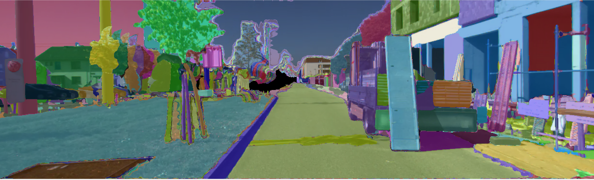
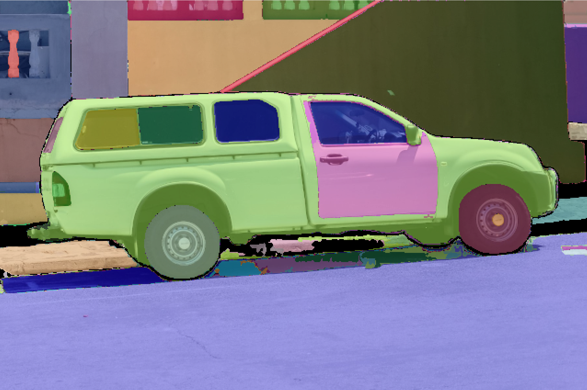

<p align="center">
 
</p>

# slamplay 

Author: [Luigi Freda](https://www.luigifreda.com)

<!-- TOC depthFrom:2 depthTo:4 -->

- [slamplay](#slamplay)
  - [Repository layout](#repository-layout)
  - [How to start](#how-to-start)
    - [Configuration](#configuration)
    - [Install data](#install-data)
    - [Deep learning (DL)](#deep-learning-dl)
      - [Install DL models](#install-dl-models)
      - [GPU support with `CUDA`, `cuDNN`, `TensorRT`](#gpu-support-with-cuda-cudnn-tensorrt)
      - [Install tensorflow C++ API](#install-tensorflow-c-api)
  - [Docker](#docker)
  - [Full SLAM](#full-slam)
    - [Visual SLAM (vSLAM)](#visual-slam-vslam)
    - [VSLAM datasets](#vslam-datasets)
    - [LiDAR-inertial SLAM (LIO)](#lidar-inertial-slam-lio)
    - [LIO datasets](#lio-datasets)
  - [Eigen Tutorials](#eigen-tutorials)
  - [Front-end](#front-end)
    - [Features DL (Deep Learning)](#features-dl-deep-learning)
    - [Depth DL](#depth-dl)
    - [Tensorflow C++ API](#tensorflow-c-api)
  - [Back-end](#back-end)
    - [GTSAM examples](#gtsam-examples)
    - [Ceres examples](#ceres-examples)
    - [g2o examples](#g2o-examples)
  - [IO](#io)
    - [chrono](#chrono)
  - [Profiling](#profiling)
    - [Tracy](#tracy)
  - [Credits](#credits)
  - [License](#license)

<!-- /TOC -->


**slamplay** is a collection of tools to start playing and experimenting with **SLAM in C++**. It installs and wires up, in a single CMake framework, some of the most important
- back-end frameworks (*g2o*, *gtsam*, *ceres*, *se-sync*, etc.),
- front-end tools (*OpenCV*, *PCL*, lidar/IMU processing, etc.),
- algebra and geometry libs (*eigen*, *sophus*, *cholmod*, etc.),
- viz tools (*pangolin*, *imgui*, *rerun*, etc.),
- loop-closure frameworks (*DBoW2*, *DBoW3*, *iBoW*, etc.),
- deep learning tools (*TensorRT*, *tensorflow_cc*, *libtorch*, *onnxruntime*, etc.),

along with commented examples to get started quickly.

I created **slamplay** for a computer vision class I taught. I started developing it for fun, during my free time, taking inspiration from some repos available on the web.

<p align="center">
 
 
 
 
</p>
<p align="center">
 
 
 
 
 
</p>

## Repository layout

| Folder | Role |
|--------|------|
| `algebra_geometry` | Eigen / geometry tutorials and examples |
| `backend` | *g2o*, *gtsam*, *ceres*, *se-sync* examples |
| `config` | YAML configs (`vslam/`, `lio_slam/`) |
| `core` | Shared libraries: DL models, `ad/` lidar–IMU stack |
| `data` | Datasets and sample assets |
| `dense_mapping` | Dense / surfel mapping examples |
| `docs` | Extra documentation |
| `frontend` | Vision and sensor front-end examples **(*)** |
| `full_slam` | End-to-end SLAM: `vslam/`, `lio_slam/`, apps |
| `io` | I/O utilities |
| `loop_closure` | Place-recognition examples |
| `ros` | ROS-compat modules (no system ROS required) |
| `results` | Default output for mapping runs |
| `scripts` | Helper scripts |
| `semantics` | Semantic segmentation **(*)** |
| `utils` | Misc utilities |
| `viz` | Visualization tools |

**(*)** C++ tools based on *TensorRT*, *tensorflow_cc*, *onnxruntime* — e.g. *SuperPoint*, *SuperGlue*, *Depth-Anything*, *HFNet*, *Segment-Anything* *(SAM)*.

**Visual SLAM building blocks** live under `core/` (`features`, `features_dl`, `depth_dl`, …) with VO and geometry examples (`camera_model`, `stereo_vision`, motion estimation, triangulation, direct method, …) in `frontend/`. The stereo SLAM pipeline is in `full_slam/vslam/` (frontend, backend, visual odometry, map).

**LiDAR-inertial building blocks** live under `core/ad/` (`laser_2d`, `laser_3d`, `imu`, `pointcloud`, `nav`, …) with LIO variants (`lio_iekf`, `lio_preinteg`, NDT, LOAM-like) in `core/ad/laser_3d/`. The mapping pipeline is in `full_slam/lio_slam/` (frontend, loop closure, pose-graph optimization, localization fusion).

---

## How to start

Tested on **Ubuntu 20.04**, **22.04**, and **24.04**.

- Install basic dependencies: `$ ./install_dependencies.sh`
- Install OpenCV locally: `$ ./install_local_opencv.sh`
- Build: `$ ./build.sh`

This takes a while. When the build finishes, enter `build/` and run the examples. See [Full SLAM](#full-slam) for the main end-to-end apps.


**No system ROS install is required.** Examples that read `.bag` files use a minimal ROS1-compatible C++ subset vendored in [`thirdparty/ros/`](thirdparty/ros/) (`librosbag.a` and message headers). There is no `catkin` workspace and no dependency on a distro ROS package. Optional ROS-compat helpers live under [`ros/`](ros/). See [`thirdparty/ros/README.md`](thirdparty/ros/README.md) for scope and limitations.

### Configuration

`config.sh` defines your working environment and is sourced automatically by the install/build scripts.

To skip the local OpenCV install, set `OpenCV_DIR` in `config.sh`. This is not recommended: mixed dependency versions can cause undefined behaviour and you may lose features.

### Install data

To run examples with the default input data, download the provided images and videos (deployed under `data/`):

`$ ./install_data.sh`

### Deep learning (DL)

#### Install DL models

To use the DL models, download weights and related data:

`$ ./install_dl_models.sh`

#### GPU support with `CUDA`, `cuDNN`, `TensorRT`

See [these tested configurations](./GPU_support.md) for the `CUDA` ecosystem.

#### Install tensorflow C++ API

For the TensorFlow C++ API (e.g. HFNet):

`$ ./install_tensorflow_cc.sh`

See [tensorflow_cc](https://github.com/luigifreda/tensorflow_cc) for details. This step is long, so you must run `install_tensorflow_cc.sh` manually.

---

## Docker

For containerized use, see [rosdocker](https://github.com/luigifreda/rosdocker) (images with or without `CUDA`).

---

## Full SLAM

End-to-end pipelines live under `full_slam/`. Config files are in the top-level `config/` folder (compiled into apps as `CONFIG_DIR`).

### Visual SLAM (vSLAM)

1. Edit `config/vslam/kitti.yaml` or `config/vslam/euroc.yaml`
2. Run:
   ```bash
   cd build/full_slam/apps/vslam
   ./run_vslam_kitti_stereo   # or ./run_vslam_euroc_stereo
   ```

Library and apps: `full_slam/vslam/`, `full_slam/apps/vslam/`.

### VSLAM datasets 

- KITTI: Download the dataset (grayscale images) from http://www.cvlibs.net/datasets/kitti/eval_odometry.php and prepare the KITTI folder as specified above
- EUROC: https://projects.asl.ethz.ch/datasets/euroc-mav/

### LiDAR-inertial SLAM (LIO)

Offline mapping pipeline (frontend → optimization → loop closure → re-optimization).

1. Edit `config/lio_slam/mapping.yaml` (bag path, dataset-specific `lio_yaml`, output under `results/`)
2. Pick a sensor preset in `config/lio_slam/` (`velodyne.yaml`, `avia.yaml`, `velodyne_nclt.yaml`, …)
3. Run the full pipeline:
   ```bash
   cd build/full_slam/apps/lio_slam
   ./run_lio_mapping
   ```

Step-wise apps (same config): `run_lio_step_frontend`, `run_lio_step_optimization`, `run_lio_step_loop_closure`, `run_fusion_offline`.      
Utilities: `dump_lio_map`, `split_lio_map`.

Related front-end demos in `frontend/laser_3d/` (implementations in `core/ad/laser_3d/`): 
- Standalone LIO: `test_3d_lio_iekf`, `test_3d_lio_preinteg`, `test_3d_lio_loosely_coupled`
- LiDAR odometry: `test_3d_ndt_lo`, `test_3d_ndt_lo_inc`, `test_3d_loam_odom` 

LIO examples use the same `config/lio_slam/` presets (`--bag_path`, `--dataset_type`, `--config`):
```bash
cd build/frontend/laser_3d
./test_3d_lio_iekf --bag_path=... --dataset_type=NCLT
```
or 
```
./test_3d_lio_preinteg --bag_path=... --dataset_type=NCLT
```

### LIO datasets

Download the datasets by using this [link](https://onedrive.live.com/?redeem=aHR0cHM6Ly8xZHJ2Lm1zL3UvcyFBZ05GVlN6U1lYTWFoY0VaZWpvVXdDYUhSY2FjdFE%5FZT1Zc09ZeTI&id=1A7361D22C554503%2190265&cid=1A7361D22C554503&sb=name&sd=1).

---

## Eigen Tutorials

See the [ascii quick reference](docs/Eigen-AsciiQuickReference.txt).

* [Quick reference](https://eigen.tuxfamily.org/dox/group__QuickRefPage.html)
* [Dense matrix manipulation](https://eigen.tuxfamily.org/dox/group__DenseMatrixManipulation__chapter.html)
* [Dense linear problems and decompositions](https://eigen.tuxfamily.org/dox/group__DenseLinearSolvers__chapter.html)
* [Sparse linear algebra](https://eigen.tuxfamily.org/dox/group__Sparse__chapter.html)
* [Geometry](https://eigen.tuxfamily.org/dox/group__Geometry__chapter.html)

---

## Front-end

Notes on selected front-end features.

### Features DL (Deep Learning)

In `frontend/features_dl` (and `core/features_dl`):
- SuperPoint and SuperGlue (TensorRT)
- [HFNet](https://github.com/ethz-asl/hfnet) (TensorRT and TensorFlow)

**Warning**: The first TensorRT run converts each *onnx* model to an *engine* and can take a while.

### Depth DL

In `frontend/depth_dl` (and `core/depth_dl`):
- [Depth-Anything-V2.0](https://github.com/DepthAnything/Depth-Anything-V2) (TensorRT)

**Warning**: Same engine-build delay on first run.

### Tensorflow C++ API

As above: `$ ./install_tensorflow_cc.sh` — see [tensorflow_cc](https://github.com/luigifreda/tensorflow_cc). See also [GPU_support.md](./GPU_support.md).

---

## Back-end

Notes on selected back-end frameworks.

### GTSAM examples

Installed tag **4.2a9**
* https://github.com/borglab/gtsam/tree/4.2a9/examples

Documentation
* https://gtsam.org/docs/
* https://gtsam.org/tutorials/intro.html
* See `docs` for more.

**Known issues**
To avoid *double free or corruption* on exit with gtsam, disable `-march=native` for gtsam-related targets (remove it from folder-level compile flags). See:
- https://bitbucket.org/gtborg/gtsam/issues/414/compiling-with-march-native-results-in
- https://groups.google.com/g/gtsam-users/c/jdySXchYVQg

### Ceres examples

Installed tag **2.1.0**
* https://ceres-solver.googlesource.com/ceres-solver/+/refs/tags/2.1.0/examples/

Documentation
* http://ceres-solver.org/tutorial.html
* See `docs`.

### g2o examples

Installed tag *20230223_git*. [Examples](https://github.com/RainerKuemmerle/g2o/tree/20230223_git/g2o/examples).

**Issues:**
- Built binaries may link the system *g2o* instead of the local build → crashes. Fixes: set `LD_LIBRARY_PATH`, or enable `RPATH` at build time (`SET_RPATH` in CMake; main file uses `-Wl,--disable-new-dtags`). See https://stackoverflow.com/questions/47117443/dynamic-linking-with-rpath-not-working-under-ubuntu-17-10
- *double free or corruption* on exit: often `-march=native` mismatch — rebuild g2o with `-DBUILD_WITH_MARCH_NATIVE=ON` if you compile slamplay with `-march=native`.

---

## IO

Notes on I/O utilities.

### chrono

https://www.modernescpp.com/index.php/the-three-clocks

**Differences amongst the three clocks?**

- **std::chrono::system_clock**: Wall-clock time; `to_time_t` / `from_time_t` for calendar dates.
- **std::chrono::steady_clock**: Monotonic; preferred for durations and timeouts.
- **std::chrono::high_resolution_clock**: Highest resolution; may alias `system_clock` or `steady_clock`.

The standard does not fix accuracy, epoch, or range. `system_clock` is usually UNIX epoch (1970); `steady_clock` is often time since boot.

**Layman terms:** *system_clock* is a watch (what time is it?). *steady_clock* is a stopwatch (how long did the lap take?).

---

## Profiling

### Tracy

Installed by `build.sh`. Repo: https://github.com/wolfpld/tracy — [docs](https://github.com/wolfpld/tracy/releases/latest/download/tracy.pdf).

- Include `profiler/profiler_tracy.h` in files you want to profile.
- Set `USE_TRACY=1` in `config.sh` so `TRACY_ENABLE` is defined project-wide.
- Add `ZoneScoped` at the start of functions to profile.
- Run `./thirdparty/tracy/tracy-profiler`, connect, then run your app.
- Use the Tracy UI **statistics** view for results.

---

## Credits

* Some C++ code and examples (updated and commented) from:
  - https://github.com/gaoxiang12/slambook2        
  - https://github.com/gaoxiang12/slam_in_autonomous_driving       
  Many thanks to the Author for his outstanding work.
* https://github.com/nicolov/simple_slam_loop_closure/ — confusion-matrix scripts.
* https://github.com/yuefanhao/SuperPoint-SuperGlue-TensorRT — SuperPoint/SuperGlue TensorRT.
* https://github.com/LiuLimingCode/HFNet_SLAM — HFNet integration.
* https://github.com/spacewalk01/depth-anything-tensorrt and https://github.com/ojh6404/depth_anything_ros — DepthAnything v2.

---

## License

`slamplay` is released under [GPLv3](./LICENSE). Modified third-party libraries retain their own licenses; where none is stated, GPLv3 applies.
